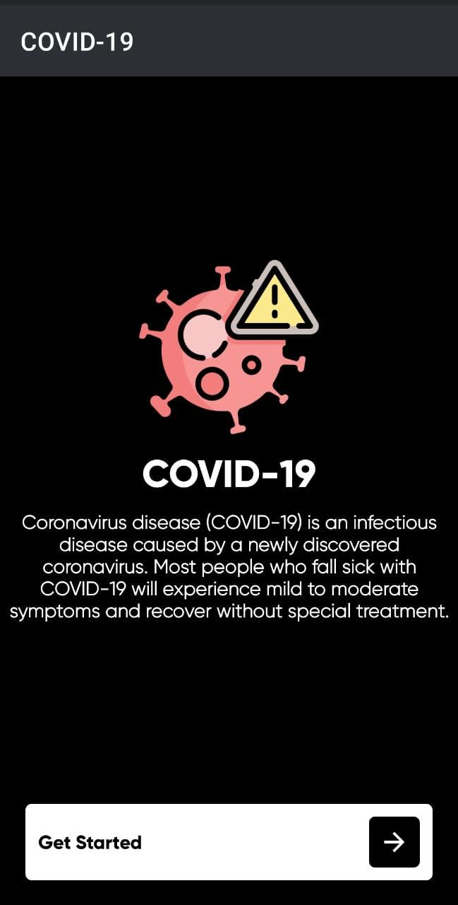
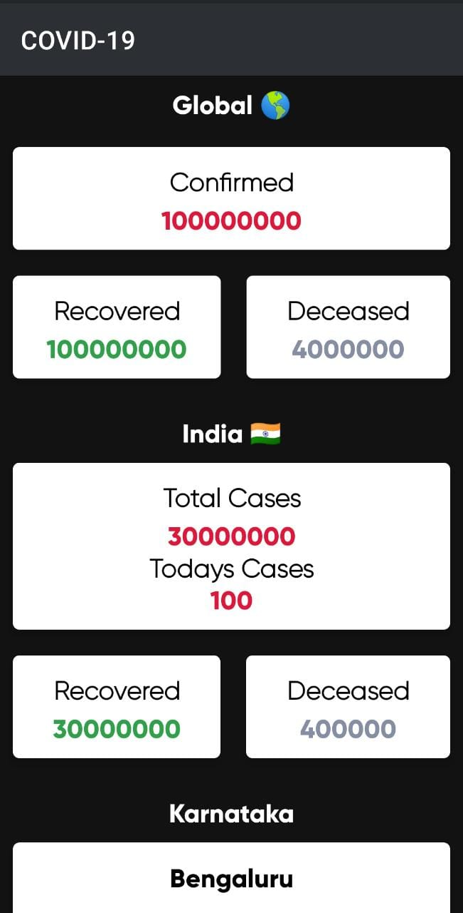
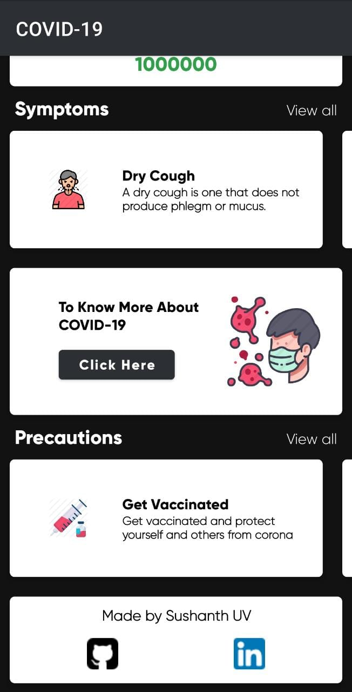
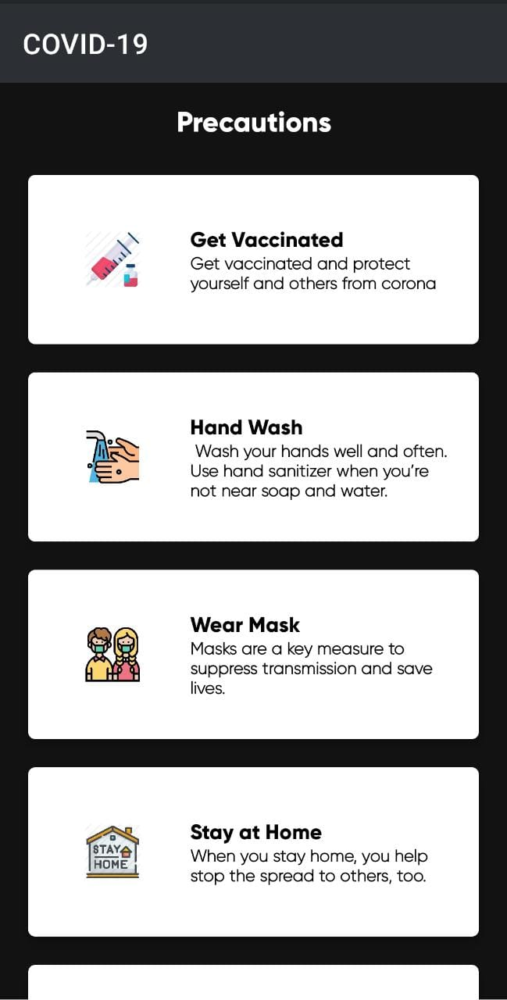
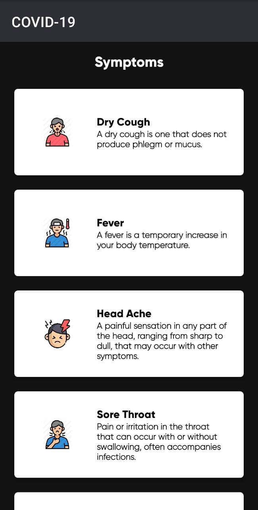

# Covid App

This is a kotlin based simple covid app having global numbers of corona cases.
One of the first simple apps I created while on my journey to learn kotlin.


##### Download APK
<pre><a href="https://github.com/SushanthOO7/Android-Covid19-App/blob/main/app-debug.apk">Covid-19</a></pre>

  
### Dependencies

1. [Material Design](https://github.com/material-components/material-components-android)

2. [Volley](https://github.com/google/volley)

## Setup

1. Star the Repo 🌟 and this will keep me motivated.


2. Clone the repository
```bash
git clone https://github.com/SushanthOO7/Android-Covid19-App.git
```


## Requirements to contribute

- Basic knowledge of programming is mandatory
- The ability to use Git and GitHub
- Some knowledge of Kotlin and how to use Android Studio is preferrable for a head start.
- UI/UX Design skills are appreciable but not mandatory
- Some idea about API or willingness to learn it


## License

This project follows the [MIT License](/LICENSE).

## Connect with me


<div align="left">
<a href="https://github.com/SushanthOO7" target="_blank">

</a>
<a href="https://www.linkedin.com/in/sushanth-uv-7899911a7/" target="_blank">

</a>
</div>
